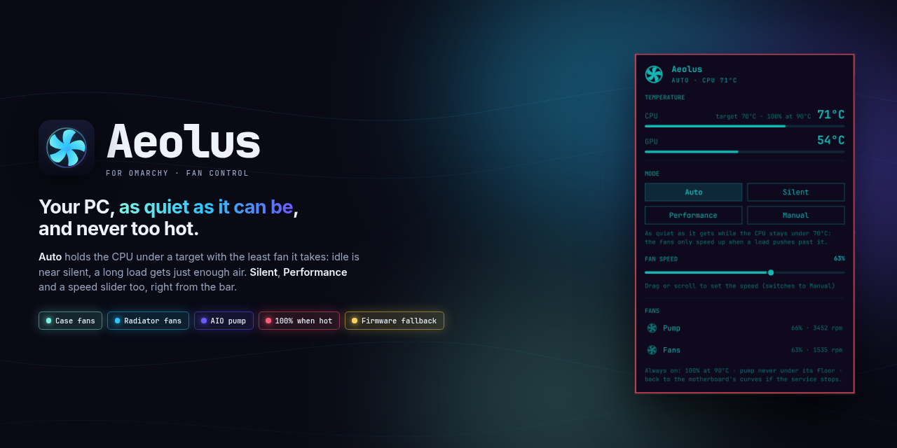
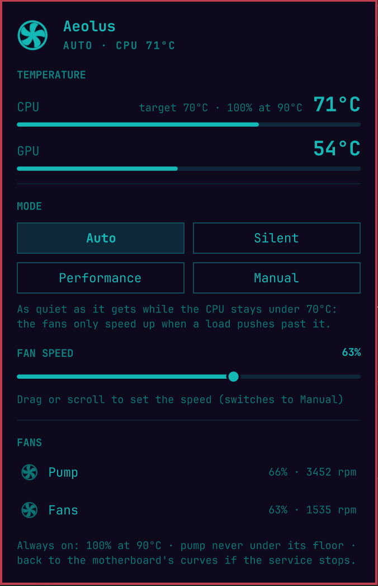
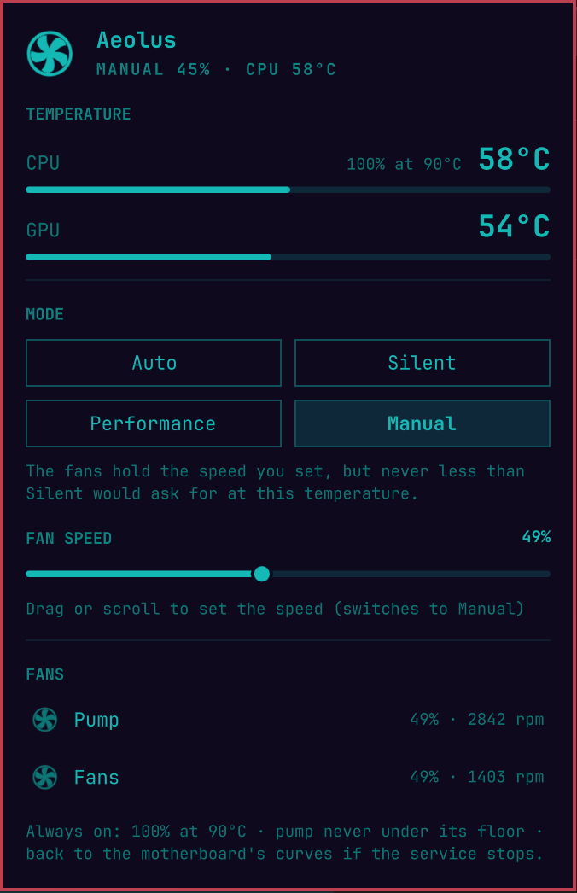

<p align="center">
  
</p>

<p align="center">
  <a href="https://omarchyplugins.com/plugin.html?id=diogocezar.aeolus"></a>
  
  
  <a href="LICENSE"></a>
</p>

<p align="center">
  <a href="#install">Install</a> ·
  <a href="#modes">Modes</a> ·
  <a href="#safety">Safety</a> ·
  <a href="#troubleshooting">Troubleshooting</a> ·
  <a href="#uninstall">Uninstall</a>
</p>

---

**Aeolus is a bar widget that keeps your PC as quiet as it can be, and never
too hot.** It drives the fans plugged into your motherboard (case fans,
radiator fans, the pump of a liquid cooler) by the temperature of your CPU and
graphics card, from one icon in your Omarchy bar.

Out of the box, many boards run those headers on aggressive firmware curves,
or flat at 100%, and on Linux there's no Armoury Crate, Fan Xpert or SignalRGB
to tame them. Aeolus does that job. Its **Auto** mode holds the CPU under a
target temperature with the least air it takes: close to silent when idle,
and only as loud as a long, heavy load really needs.

<table>
  <tr>
    <td align="center" width="50%"></td>
    <td align="center" width="50%"></td>
  </tr>
  <tr>
    <td align="center"><b>Auto</b>, under a full load: the CPU held at its 70 °C target</td>
    <td align="center"><b>Manual</b>: drag the slider, the fans follow</td>
  </tr>
</table>

### On the machine it was built on

Ryzen 7 7700, 240 mm liquid cooler, ASUS TUF B650 (Nuvoton NCT6799):

| | Firmware curves (before) | Aeolus, Auto |
|---|---|---|
| **Idle** | radiator fans flat at **100%** (2050 rpm), pump at 3400 rpm | radiator fans at **790 rpm**, pump at 2300 rpm |
| **4 min of full load, all 16 threads** | the same 100% | CPU steady at **70–70.5 °C**, fans at about **51%** (1380 rpm) |
| **After the load** | the same 100% | back at idle speed within **30 s** |

## Features

| | |
|---|---|
| 🤫 **Auto: the least fan it takes** | Holds the CPU under a target (70 °C) instead of following a fixed curve: fans stay at their floor until a load pushes past the target, then speed up exactly as far as it takes to hold it. |
| 🎚️ **Modes and a slider** | Auto, Silent, Performance, or Manual with a fan speed slider right in the popup. Drag or scroll it and Aeolus switches to Manual. |
| 🌡️ **Temperatures at a glance** | CPU and (for NVIDIA cards) GPU, big, each with a meter toward the emergency limit; every header with its duty and rpm. |
| 🛡️ **Safety rails, always on** | 100% when hot, a floor the pump never goes under, full speed if a fan stops or a sensor is lost, and the motherboard's own curves back whenever the service stops. See [Safety](#safety). |
| 🌀 **No spin-ups on spikes** | A Ryzen jumping 20 °C for a second doesn't rev the fans; a real load does, within seconds, and they wind down gently after. |
| 🎮 **GPU aware** | A hot graphics card lifts the case and radiator fans too, not the pump. |
| 📏 **Measured, not guessed** | Setup runs each header through a few speeds to tell the pump from the fans and find where they stop. |
| ✅ **Tested** | 43 automated tests, including the service end to end on a fake `/sys/class/hwmon`, plus the rails exercised on real hardware (`kill -9`, frozen process, forced emergency). |
| 🌍 **Multilingual** | English, Português, Español, Français and Deutsch, following your system locale. |

## Requirements

- A motherboard whose fan controller has a Linux driver with PWM control.
  That covers most desktop boards: **Nuvoton NCT67xx** (`nct6775`, most ASUS,
  ASRock and MSI boards) and **ITE IT87xx** (`it87`, most Gigabyte boards).
  The installer finds and loads the driver for you.
- The fans you want to control plugged into **motherboard headers**. Fans on a
  USB hub with its own controller (Corsair iCUE, NZXT, Lian Li) are not
  motherboard headers.
- Laptops are not supported: their fans belong to the embedded controller.

## Install

### 1. Install the plugin

From the **Omarchy Plugin Marketplace**, or by hand:

```bash
omarchy plugin add https://github.com/diogocezar/omarchy-aeolus --enable
```

### 2. Install the service, once

Driving fan headers needs root, so the part that does it is a small system
service. The plugin itself never runs anything as root; you install the
service yourself, once:

```bash
sudo ~/.config/omarchy/plugins/diogocezar.aeolus/system/install.sh
```

It's a short shell script: please read it before running it with `sudo`. It:

1. copies `system/aeolus.py` to `/usr/local/bin/aeolus` and the systemd unit
   to `/etc/systemd/system/aeolus.service` (root-owned copies: the service
   never runs code from your plugin folder);
2. loads the fan controller driver if it isn't loaded, and adds it to
   `/etc/modules-load.d/aeolus.conf` so it loads at boot;
3. runs `aeolus setup`, which measures each spinning header for a few seconds
   (it never takes a header under 40% while measuring) and writes
   `/etc/aeolus/config.json`;
4. enables and starts `aeolus.service`.

It never overwrites a file it didn't create. Run it in a terminal to answer
setup's questions (which header is the pump, names); run without one, it
takes the suggestions as they are.

Until the service is installed, the popup shows that command with a button to
copy it.

## Modes

Click the fan icon in the bar to open the popup, then pick a mode.


| Mode | What it does |
|---|---|
| **Auto** (default) | The quietest that keeps the CPU under its target (70 °C). Fans sit at their floor; when a load pushes the CPU past the target, they speed up exactly as far as it takes to hold it, and wind back down when it's over. Never below Silent. |
| **Silent** | A fixed low curve. The CPU may run warmer (up to the high 70s) before the fans speed up. |
| **Performance** | A fixed high curve: cooler and louder. |
| **Manual** | The fans hold the speed you set with the slider, but never less than Silent would ask for at the current temperature. Dragging or scrolling the slider switches to Manual. |

The pump is driven separately from the fans: it starts higher (a pump is quiet
and is what carries the heat to the radiator) and gets a share of Auto's boost.

| Shortcut | What it does |
|---|---|
| **Click** the icon | Open the popup |
| `←` / `→` in the popup | Cycle the modes |
| `↑` / `↓` in the popup | Scroll |
| **Scroll** on the slider | Change the fan speed in steps of 5% |
| `Esc` | Close the popup |

The icon turns **red** when a safety rail is active (too hot, a fan stopped, no
temperature); the popup says which.

## Safety

These hold in every mode, Manual included:

- **Floors.** No header ever goes under its floor: 40% for a pump, 20% for
  fans (higher if setup saw the header stop at 40%). A config with a pump
  floor under 30% is refused.
- **Emergency.** CPU at 90 °C (or GPU at 87 °C): every header at 100%,
  immediately and without smoothing, until the CPU is back under 80 °C.
- **A header that stops.** One reading 0 rpm for 6 seconds while driven well
  above its floor: every header at 100%.
- **No temperature.** Five readings in a row lost: every header at 100%.
- **Firmware fallback.** Whenever the service stops (stopped, crashed, killed,
  or frozen and killed by the systemd watchdog after 15 s), the headers go
  back to the motherboard's own curves (`ExecStopPost=aeolus restore`).
  `systemd` restarts the service two seconds later.
- **Resume.** If the firmware takes a header back (e.g. after suspend), the
  service takes it back within a second.

The service runs sandboxed (`ProtectSystem=strict`, `ProtectHome`,
`PrivateNetwork`, `NoNewPrivileges`, …). The popup only reads
`/run/aeolus/status.json` and asks for a mode with `aeolus mode`, which writes
one line to `/run/aeolus/mode`, a file only root and the `wheel` group can write.
The service accepts nothing there but a mode name.

## Settings

The bar widget has one setting, the language (`auto` follows the system):

```bash
omarchy bar set diogocezar.aeolus language pt
```

Everything else lives in `/etc/aeolus/config.json` (restart the service after
editing it: `sudo systemctl restart aeolus`):

| Key | Default | Meaning |
|---|---|---|
| `target` | `70` | °C the CPU is held under in Auto (55–85) |
| `emergency` | `90` | °C (CPU) for every header at 100% |
| `emergencyClear` | `80` | °C (CPU) to leave the emergency |
| `gpuEmergency` | `87` | °C (GPU) for every header at 100% |
| `gpu` | `true` if `nvidia-smi` exists | lift the fans by the GPU temperature |
| `group` | `wheel` | who may change the mode |
| `channels` | from setup | `chip`, `pwm`, `role` (`pump`/`fan`), `label`, `floor` (%) |
| `curves` | built in | optional `{"silent": {"fan": [[temp, %], …]}, "performance": …}` |

To measure again (new fans, a header moved): `sudo rm /etc/aeolus/config.json`
and run the installer again.

## Command line

```bash
aeolus status            # mode, temperatures, every header
aeolus status --json
aeolus mode auto         # or silent, performance, "manual 45"
sudo aeolus setup        # measure the headers and write the config
sudo aeolus restore      # hand the headers back to the firmware now
journalctl -u aeolus     # what the service did, and why
```

## Update

Update the plugin from the marketplace (or `git pull`), then run the installer
again so the service copy matches; the popup tells you when they differ:

```bash
sudo ~/.config/omarchy/plugins/diogocezar.aeolus/system/install.sh
```

## Uninstall

```bash
sudo ~/.config/omarchy/plugins/diogocezar.aeolus/system/uninstall.sh
omarchy plugin remove diogocezar.aeolus
```

The uninstaller stops the service (the headers go back to the firmware's
curves) and removes only the files the installer recorded as its own.

## How it works

`system/aeolus.py` is one file of plain Python 3, standard library only. As a
service, once a second it:

1. reads the CPU temperature (`k10temp` Tctl on AMD, `coretemp` Package on
   Intel) and, every three seconds, the GPU's (`nvidia-smi`);
2. filters it: median of the last five readings, then an average that rises
   fast and falls slowly;
3. works out each header's duty from the mode (in Auto, a controller adds to
   the floor while the CPU is over the target and takes it away while it's
   under), applies the floors and rails, and eases the change in;
4. writes the PWM files under `/sys/class/hwmon`, and the status file the
   popup reads.

The headers are found by chip name and device path, not by `hwmonN` numbers,
which change between boots.

### Tests

```bash
python3 -m unittest discover -s tests -v
```

43 tests: the curves and config validation, reading the GPU (capped output, timeouts), the controller (spikes, ramps,
floors, emergency, lost sensor, stalls, Auto holding its target on a simple
thermal model), and the service end to end against a fake
`/sys/class/hwmon` (taking control, following the temperature, restoring the
firmware on stop and after a `kill -9`, taking a header back after resume,
mode requests and persistence).

## Troubleshooting

**The popup says the service isn't running.** Install it (above), or see why
it stopped: `systemctl status aeolus` and `journalctl -u aeolus -b`.

**`no spinning PWM header found`.** Your fan controller's driver isn't loaded
or isn't supported. Check `sensors` for an `nct67xx` or `it87xx` chip. Some
Gigabyte boards need `it87` from [frankcrawford/it87](https://github.com/frankcrawford/it87),
and some boards need `acpi_enforce_resources=lax` on the kernel command line
for the driver to load.

**A header is missing.** Setup only lists headers that report rpm. A fan that
the firmware had stopped (0 rpm mode) isn't seen: set it to spin in the BIOS,
then measure again.

**Pump and fans are swapped.** Setup guesses a pump from a full speed above
2800 rpm. Run the installer in a terminal to choose, or edit `role` in
`/etc/aeolus/config.json`.

**My graphics card's fans don't move.** Aeolus doesn't drive the graphics
card: its own firmware does, and most cards keep their fans stopped below
50–60 °C.

## License

[MIT](LICENSE)
